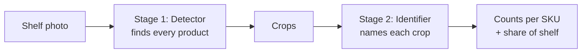
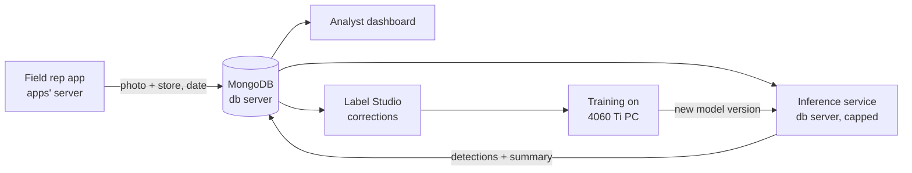

# Shelf Detector Roadmap

2026-09-22 · @Someone

## Summary

A working MVP that counts products per SKU and computes share of shelf from a field rep's photo, demoed in about 2 weeks (3 at most), then improved monthly with rep and labeler feedback.

- **Deliverable:** an internal REST API. Upload a shelf photo, get counts per `BRAND_CATEGORY_SKU` (e.g. `Kix-Max_canned_blueberry`), grouped by brand, plus share of shelf per category.
- **Business goal:** monitor our share of shelf against competitors, and free field reps from counting by hand.
- **Scale:** about 20,000 existing photos of whole aisles and fridges, 100–500 products each, about 400 classes (ours plus competitors).
- **MVP bar:** a visible, honest baseline. Low accuracy is acceptable at the start; a clear improvement path is not optional.
- **Team:** 1–2 engineers now; 5–10 labelers at 3–4 h/day from month 2.

## Approach

We split the problem in two: a detector that finds every product, then an identifier that names each one. A single model that draws boxes and picks among 400 classes would need about 90,000 hand-drawn boxes for 300 photos alone, which doesn't fit the timeline.



Each photo flows left to right; only stage 2 knows our product list.

| Stage | MVP version | Later version | Labeling needed |
| --- | --- | --- | --- |
| 1. Detector | YOLO trained on the public SKU-110K shelf dataset | Fine-tuned on our corrected boxes | None for MVP |
| 2. Identifier | Embedding model (DINOv2 or CLIP) + nearest match against a reference gallery of packshots and crops | Classifier fine-tuned on corrected crops | A few reference images per SKU |

Why this design:

- **No training for stage 2.** A new SKU means adding reference images, not retraining.
- **Unknown products fall out as "other"** instead of being forced into a wrong class.
- **Faster labeling.** Labelers correct pre-drawn boxes and pick from top-5 suggestions instead of drawing from scratch.

## Architecture

The inference service runs on the db server, next to the photos, and writes raw detections back to MongoDB so any later dashboard or app reads from one place.



Photos come in from the reps' app, results go back beside them, and corrections feed the next model.

**Predictions collection.** One document per photo per model run; raw detections are the source of truth, counts are derived:

```json
{
  "photo_id": "...",
  "model_version": "det-sku110k-v1+emb-gallery-v1",
  "created_at": "...",
  "detections": [{"box": [x1, y1, x2, y2], "class": "Kix-Max_canned_blueberry", "confidence": 0.81}],
  "summary": {
    "counts": {"Kix-Max": {"canned": {"blueberry": 3}}},
    "share_of_shelf": {"soda": {"Kix-Max": 0.22, "other": 0.78}}
  }
}
```

- **Recomputable:** a better model or a new brand grouping reprocesses without re-labeling.
- **Correctable:** detections render as editable boxes for reps; corrections become training data.
- **Comparable:** keeping every `model_version` lets two models be compared on real traffic.

**Serving.**

- FastAPI in Docker on the db server, capped at 4 CPU cores and about 3 GB RAM so MongoDB is protected.
- Not exposed to the internet; only company apps call it.
- Sync endpoint for the MVP. A background worker that processes new uploads automatically comes in month 3, reusing the same code.
- Models are exported to ONNX for faster CPU inference; about 1–3 s per photo is expected and fine, since nobody waits on it.

## Phase 0 — Foundations (days 1–3)

By day 3: data is exportable, the test set is fixed, labeling is secured, and the business side is gathering classes and packshots.

**Status (2026-09-22):** not finished. A read-only survey of the live `atpg` database
found the export config mapping fields that do not exist there, so no manifest and no
fixed test set exist yet. Remaining work, with the real schema and the numbers behind
it, is in [`PHASE0_REMAINING.md`](PHASE0_REMAINING.md).
Checkboxes below: `[x]` done · `[~]` partly done, see the note · `[ ]` not started.

- [~] **Secure Label Studio.** Set `LABEL_STUDIO_DISABLE_SIGNUP_WITHOUT_LINK=true`, remove unknown accounts, use strong passwords. It's on the public internet, so this comes first. — *the running instance was hardened by hand, but the committed `deploy/label-studio/` could not reproduce it (would not start; published on `0.0.0.0`; no photo mount). The compose file is fixed now; the live instance still needs to be migrated onto it, and its member list re-checked.*
- [ ] **Export script.** Pull photos plus metadata (store, date, rep, visit) out of MongoDB to disk, read-only, in batches. — *written, but `configs/export.yaml` points at a schema this database does not have, and the credential in use is `root`, not a read-only user.*
- [ ] **Manifest.** One CSV row per photo: id, store, visit, date, file path, image size. Every dataset later is built from it. — *blocked on the export; note `visit_id`, `rep_id` and `city` do not exist on the photos, so those columns will be empty or must come from the `location` join.*
- [ ] **Fixed test set.** 30 photos from stores held out of training entirely, split by store, never by random photo. Mix aisles, fridges, glare, and store types. — *feasible: 3,292 stores in the usable `shelf` subset.*
- [ ] **Class list** requested from sales/analysts in `BRAND_CATEGORY_SKU` form; competitors may start as `COMPETITOR_<category>`. — *`configs/classes.csv` is still the `Kix-Max` template.*
- [ ] **Packshots** requested from marketing: 2–5 images per SKU, ours first, competitors where available.
- [~] **Labeling guide,** one page: what counts as a face (front row only, visible label), partly hidden products, fridge glass, and 3 annotated example photos. — *written (`labeling_guide.md`); the 3 annotated examples are still a placeholder.*

## Phase 1 — Working pipeline (days 4–10)

By day 10: a script turns a photo into SKU counts end to end, with accuracy measured on the test set.

- [ ] **Detector.** Train a small YOLO on SKU-110K overnight on the 4060 Ti, or use published weights if their license allows. Check by eye that it finds most products on 10 of our photos.
- [ ] **Small objects.** Use a larger input size (1280) or tiled inference (SAHI) for whole-aisle photos.
- [ ] **Label the test set** in Label Studio with the detector's boxes pre-filled; correct boxes and assign classes. Brand level first if time is short.
- [ ] **Reference gallery.** Packshots plus crops from the corrected test-adjacent photos (never from the test set itself), one folder per SKU.
- [ ] **Embedding matcher.** Embed each crop, find the nearest gallery match, and label it `other` below a similarity threshold.
- [ ] **Evaluation script.** Per-brand count error and share-of-shelf error on the test set, plus detector recall.

## Phase 2 — MVP demo (days 11–15)

By day 15: a deployed API, a visual overlay, honest numbers, and the plan for month 2. Days 16–21 are buffer, not new features.

- [ ] **FastAPI service:**
  - `POST /count`: upload, nested counts by brand → category → SKU, share of shelf per category, and a write to `predictions`.
  - `POST /overlay`: returns the photo with colored boxes. Managers trust what they can see, and it's the best debugging tool.
  - `GET /health`: model version and status.
- [ ] **Docker** with CPU and memory limits, deployed on the db server beside the existing containers, touching no existing app.
- [ ] **Run on the test set** and report results in business terms ("brand counts off by X faces per photo"), not just mAP.
- [ ] **Demo:** the overlay, the JSON, the numbers, and Phases 3–4 as the path forward.

## Phase 3 — Data flywheel (month 2)

The goal of month 2 is flavor-level accuracy, bought with corrected data rather than model tricks.

- [ ] **Pre-labeling loop.** The model labels batches of the 20k photos; 5–10 labelers correct them. Prioritize low-confidence photos, fridges, and SKUs with few examples.
- [ ] **Fine-tune the detector** on our corrected boxes.
- [ ] **Train a crop classifier** for the \~400 classes; keep the embedding matcher as a fallback for new SKUs.
- [ ] **MLflow,** self-hosted: log every experiment and register models. A model is promoted only if it beats the current one on the fixed test set.
- [ ] **Dataset versioning** with DVC on object storage. SeaweedFS or Garage go on a new disk on the db server; check MinIO's current licensing before choosing it.
- [ ] **Disk:** budget an extra 500 GB–1 TB drive. The 100 GB free now won't hold exports, datasets, and model artifacts.

## Phase 4 — Production (month 3+)

From month 3, the system runs on its own: new photos are processed automatically, reps correct results, and models retrain on a schedule.

- [ ] **Background worker** processes new uploads automatically; the sync API stays available.
- [ ] **Rep correction screen** in the field app; each fix flows back into training data.
- [ ] **Analyst dashboard** built on `predictions.summary`: share of shelf by store, city, category, and over time.
- [ ] **Monitoring:** confidence distributions, the share of `other` (rising = new products or packaging), per-store drift, latency.
- [ ] **Monthly retraining,** gated by the fixed test set.
- [ ] **Reverse proxy for all apps** (e.g. Caddy), proposed once the MVP has earned goodwill; it closes the open-ports gap for every app, not just this one.

## Risks and mitigations

The biggest risk is flavor-level confusion; brand-level counts will be reliable well before SKU-level counts.

| Risk | Impact | Mitigation |
| --- | --- | --- |
| Similar flavors look alike (blueberry vs strawberry can) | Wrong SKU, right brand | Report brand level first; the classifier in Phase 3 targets this |
| Pack size hard to judge (330 ml vs 500 ml) | Wrong SKU | Separate classes, plus shelf-context rules later |
| Fridge glass and glare | Missed products | Extra labeling priority for fridges; photo guideline |
| Inconsistent rep photos | Lower accuracy everywhere | Short guideline: stand back, shoot straight, one bay per photo |
| Test set leaks into training | Inflated numbers | Split by store, fixed from day 3 |
| Inference slows MongoDB | Slow apps | Container CPU/RAM limits; move to a dedicated box if needed |
| Label Studio exposed publicly | Data exposure | Signup disabled day 1; reverse proxy in Phase 4 |
| Class list or packshots arrive late | Stage 2 slips | Start with a brand-level gallery and `COMPETITOR_<category>` |

## Resources and dependencies

The MVP needs no purchases; month 2 needs one extra disk and labeler time.

| Need | From | When |
| --- | --- | --- |
| Class list (`BRAND_CATEGORY_SKU`, \~400) | Sales / analysts | Day 3 |
| Packshots, 2–5 per SKU | Marketing | Day 5 |
| 4060 Ti PC for overnight training | IT / owner of the PC | Day 4 onward |
| Docker deploy slot on db server | Engineering | Day 12 |
| Extra 500 GB–1 TB disk on db server | Management | Month 2 |
| 5–10 labelers, 3–4 h/day | Management | Month 2 |
| Rep correction screen in field app | Engineering | Month 3 |

**Tools:** Ultralytics YOLO, SAHI, DINOv2 or CLIP, FastAPI, Label Studio, Docker, and later MLflow, DVC, and SeaweedFS or Garage. All free and open source; check each model's weights license before production use.
