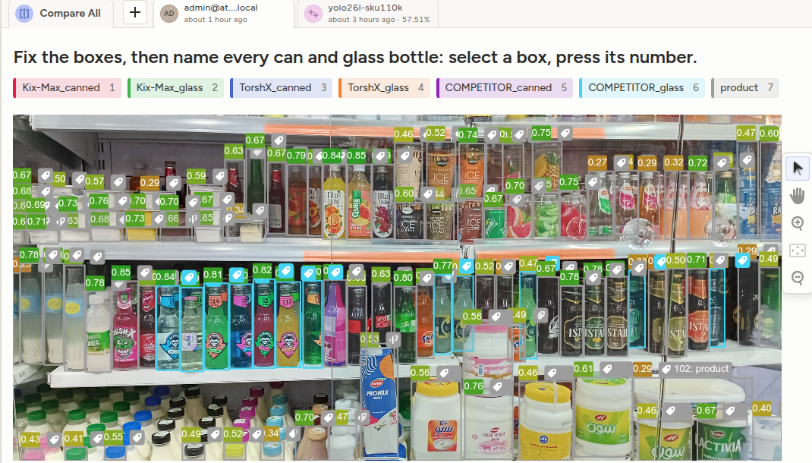
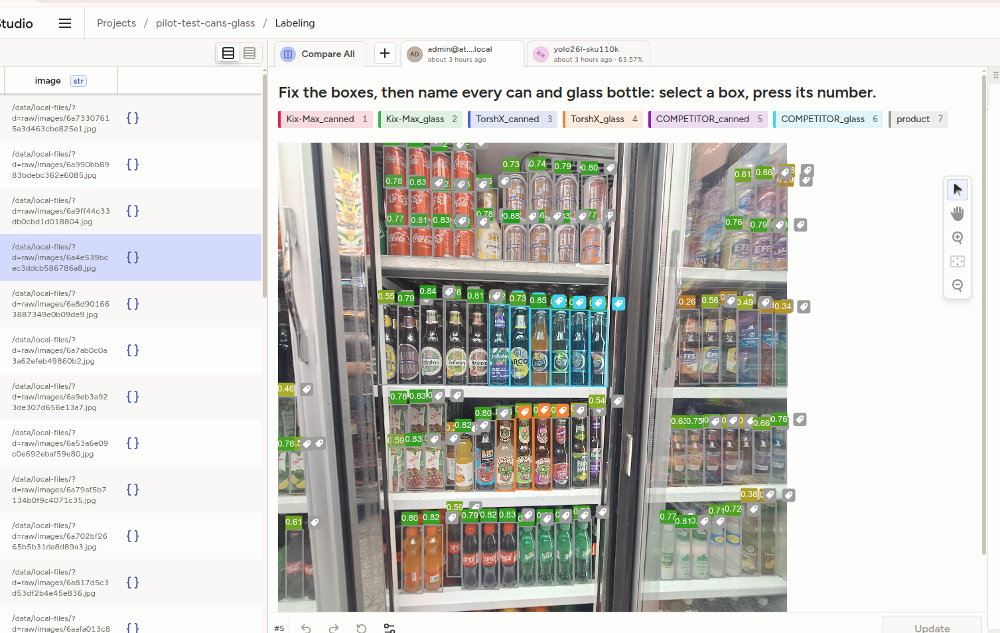
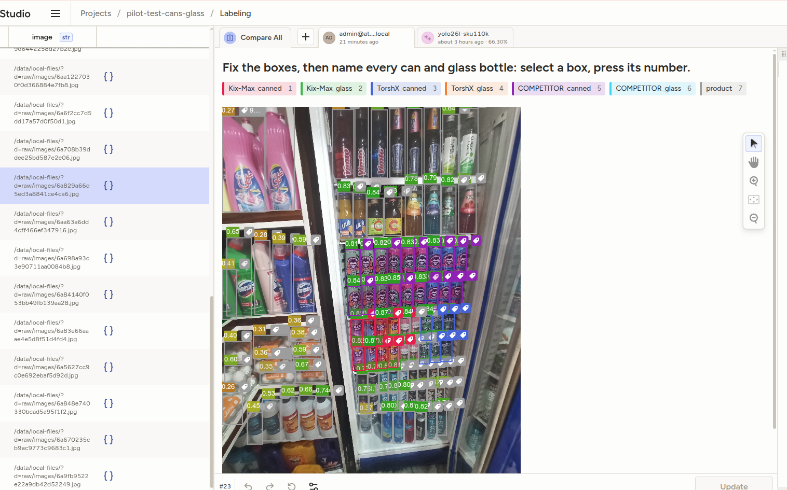

# Labeling guide: shelf product faces

Version 0.1. Every labeler follows this page. If the page doesn't answer a case, write
it in the task's **Notes** box and ask. Don't guess differently from everyone else.

## What to box

- **One box per product face.** A face is one unit whose front (label side) is visible
  in the **front row** of the shelf or fridge.
- **Tight boxes.** Draw around the visible product, not its shadow or the price tag.
- **Label every product in the photo, ours and competitors'.** An unlabeled product
  teaches the model that it's background.

## Class names

- Format: `BRAND_PACKTYPE_SKU`, for example `Kix-Max_canned_blue-berry`. The pack
  type is what you see: `canned`, `glass` (glass bottle), `milk-straw`, and so on.
- Competitors: `COMPETITOR_<pack type>`, by what the product physically is, for
  example `COMPETITOR_canned`, `COMPETITOR_glass`, `COMPETITOR_oil`,
  `COMPETITOR_dressing`, `COMPETITOR_plastic-bottle`. If none fits, use
  `COMPETITOR_other` and write what it is in Notes. Use a named
  competitor class only if it is in the list. Always box competitors — a missing
  competitor box makes our share of shelf look bigger than it is.
- Glass bottle and plastic bottle are different: `glass` is glass only.
- Products that are nothing like anything we sell or report on (shampoo,
  detergent, …): box them as `out_of_scope`. Don't label them as competitors.
- Press **Shift+F** and type to search the class list.
- Once per browser: open the **gear icon** (Settings) in the labeling screen and turn on
  **Show labels inside the regions**, so every box shows its class on the photo.
  It's off by default, which makes a wrong or missing class easy to miss.

## Edge cases

| Situation | Rule |
| --- | --- |
| Product behind the front row (second row visible) | Don't box |
| Front face at least 50% visible | Box it, box only the visible part |
| Front face less than 50% visible, or only the side visible | Don't box |
| Stacked units (one on top of another, both front row) | Box each one |
| Behind fridge glass, label readable | Box it |
| Glare or blur makes the flavor unreadable, brand readable | Box with the brand's closest class, write `unsure-sku` in Notes |
| Can't tell the brand at all | Don't box; write `unknown product` in Notes |
| Multipack or shrink-wrapped tray | One box for the whole pack, write `multipack` in Notes (to be decided) |
| Product on a promo stand or floor display | Box it like a shelf product |
| Product image on a poster, price tag, or cardboard | Don't box: it's not a product |

## Pre-drawn boxes and their numbers

Photos open with boxes a detector already drew. Each box shows a number, the
detector's confidence. **Ignore it.** Judge every box by the rules on this
page, whatever its number:

- A high number does not mean the box is right. Reflections in fridge glass,
  price tags and posters can score high. Check every box, not only the
  low-numbered ones. Don't sort or skip boxes by their number.
- **The worst mistakes are the boxes that aren't there.** The detector only
  draws a box when it is fairly sure, so the products it missed are exactly
  the hard ones: behind glare, small, dark, half hidden. You must add those
  yourself. Accepting the pre-drawn boxes as they are is the most common
  labeling error.
- The number is not saved with your labels. Only your boxes count.

## Before you submit

- Zoom in once across the whole photo and check for missed products. Look
  hardest where the detector drew nothing: glare, dark corners, top and
  bottom shelves, and the photo's edges.
- Fill in the three photo fields below the photo (next section).
- Aim for about 10 to 20 minutes per photo. If a photo takes longer than 30 minutes,
  skip it and tell the project lead.

## The three photo fields (from 2026-09-28)

Below the photo are three fields, filled once per photo, not per box. The
screen shows them in Persian; what is saved is the English value in brackets.

1. **Scene type**, exactly one, required (Submit refuses without it): open
   fridge (`open-fridge`), glass-door fridge (`glass-door-fridge`), shelf
   aisle (`shelf-aisle`), counter (`counter`), promo stand or floor display
   (`display`), fridge and shelf in one photo (`mixed`). If two appear, pick
   the one taking most of the photo, or `mixed`.
2. **Capture problems**, any number or none: `glare`, `reflection` (mirror
   images of products on glass, a shiny floor or shelf: never box them),
   `blur`, `dark`, `angled`, `far`, `wide-cluttered` (the frame takes in a
   very wide area with a lot of detail, so products look small and jumbled),
   `occluded`, `cut-off`. Tick one only when
   it really makes products harder to count or name.
3. **Photo problems**, any number or none: `not-a-shelf` (screenshot,
   storefront), `no-drinks` (no can or glass bottle at all), `multi-bay`.

Hover over an option for a one-line hint. These feed the sliced metrics in
`docs/ERROR_ANALYSIS.md` §1 and the batch choice in
`docs/LABELING_STRATEGY.md` §8. Persian translation of this guide:
[`README.fa.md`](README.fa.md).

## Pilot: cans and glass bottles (test set, from 2026-09-27)

The pilot measures our share of cans and of glass bottles. It labels in **one
pass**, and it names brands, not flavours.

Every photo opens with boxes already drawn by a detector, all labeled `product`
(grey).

1. **Fix the boxes, on every product, not only drinks.** Delete boxes on
   reflections, empty dark spots, price tags and posters. Delete the extra box
   when one product has two. Draw a box on every product the detector missed.
   Tighten boxes that are clearly off. The rules above ("What to box", "Edge
   cases") still decide what counts.
2. **Name every can and every glass bottle.** Click the box, then press its
   number or click the label:

   | Key | Label | Use for |
   | --- | --- | --- |
   | 1 | `Kix-Max_canned` | Any Kix-Max can, any flavour |
   | 2 | `Kix-Max_glass` | Any Kix-Max glass bottle, any flavour |
   | 3 | `TorshX_canned` | Any TorshX can, any flavour, energy drink included |
   | 4 | `TorshX_glass` | Any TorshX glass bottle, any flavour |
   | 5 | `COMPETITOR_canned` | Any other can |
   | 6 | `COMPETITOR_glass` | Any other glass bottle |
   | 7 | `product` | Everything else: plastic bottles, cartons, snacks, oil... |

   Targeted competitors (from 2026-09-29): no number key, click the label.

   | Label(s) | Brand |
   | --- | --- |
   | `Icy-Monkey_canned`, `Icy-Monkey_glass` | Icy Monkey (ایسی مانکی) |
   | `Hoffenberg_canned`, `Hoffenberg_glass` | Hoffenberg (هوفنبرگ) |
   | `Laimon-Fresh_canned`, `Laimon-Fresh_glass` | Laimon Fresh (لایمون فرش) |
   | `Fizzio_glass` | Fizzio (فیزیو) |
   | `Freshy-Day_glass` | Freshy Day (فرش دی) |
   | `Genius_glass` | Genius (جنیوس) |
   | `Sunich-Cool_glass` | Sunich Cool (سن ایچ کول) |

   Other competitors' cans and glass bottles (Coca-Cola, Bear, ...) may stay
   `product`. A box with no label counts as `product`.

3. **Leave everything else as `product`, but keep its box.** Don't use
   `out_of_scope` or `COMPETITOR_other` in the pilot. `product` means "not
   named yet": a later round names those boxes without redrawing them. Grey
   boxes follow the same rules as named ones (front row, at least 50%
   visible, no reflections), because they are the ground truth for how many
   products the detector should find.

Unsure whether a bottle is glass or plastic? Leave it `product` and write
`glass?` in Notes. A can or glass bottle whose brand you can't read is a
competitor unless it's clearly ours.

## Examples

Three test photos, labeled for the pilot and screenshotted in Label Studio with
**Show labels inside the regions** on (company photos: private repo only). The
coloured boxes are named cans and glass bottles; the grey ones are `product`,
boxed but not named. The numbers on the boxes are the detector's confidence;
ignore them (see "Pre-drawn boxes and their numbers").

1. **Drinks fridge behind glass**, mixed glass bottles and dairy (test photo
   #06, `6a7ab0c0a3a62efeb49860b2`). Competitor glass bottles named; milk,
   yoghurt and plastic bottles left as `product`.

   

2. **Glass-door fridge with glare**, cans and glass bottles (test photo #04,
   `6a4e539bcec3ddcb586786a8`). TorshX glass bottles (orange) next to
   competitor glass bottles (light blue); cans in the top row not ours or not
   glass stay grey until named.

   

3. **Crowded small-shop fridge** next to a cleaning-products shelf (test photo
   #22, `6a829a66d5ed3a8841ce4ca6`). Kix-Max cans (red), TorshX cans (blue) and
   competitor cans (purple); detergent bottles stay `product`.

   
